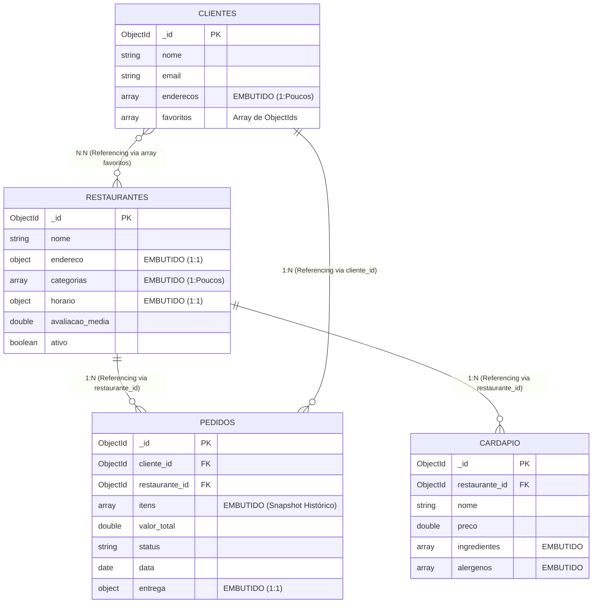

# Checkpoint 1 — Modelo de Referência: GastroHub
**Disciplina:** Banco de Dados NoSQL (TSI34E-TSI4) — UTFPR Campus Guarapuava  
**Professor:** Prof. Marcelo Vichar  
**Equipe de Exemplo:** GastroHub Core Team  
**Data:** 15/09/2026  

---

> [!NOTE]
> **Aviso aos Estudantes:** Este documento serve como **modelo de referência e padrão de excelência** para a entrega do **Checkpoint 1**. Os projetos das equipes devem ter temas **originais e distintos** do GastroHub, mas seguir o mesmo rigor técnico de detalhamento, justificativas e coerência de dados.

---

## 1. Tema e Escopo do Sistema (15 pontos)

O **GastroHub** é uma plataforma de delivery gastronômico e gestão de pedidos voltada a polos gastronômicos locais e cidades de médio porte, como Guarapuava-PR. O sistema conecta três perfis principais de usuários: **clientes finais** (que navegam por restaurantes, customizam pratos e acompanham pedidos em tempo real), **restaurantes parceiros** (que gerenciam cardápios, horários de funcionamento e a fila de produção da cozinha) e **entregadores** (que recebem despachos e endereços de entrega).

O problema central que o sistema resolve é a **alta latência de leitura e a sobrecarga de JOINs relacionais** típica de horários de pico (ex: noites de sexta a domingo). Em bancos relacionais legados, a renderização da página inicial de um restaurante exige cruzar múltiplas tabelas normalizadas (*restaurantes, fotos, horários, categorias, itens, adicionais, alérgenos*), gerando gargalos de I/O sob concorrência.

No GastroHub, o modelo foi desenhado sob o paradigma **Query-Driven Modeling** do MongoDB: os documentos refletem diretamente o formato de dados consumido pelo aplicativo móvel e pelo painel web da cozinha, garantindo consultas de leitura atômicas e tempo de resposta sub-milissegundo para os fluxos mais frequentes da aplicação.

---

## 2. Entidades e Coleções (25 pontos)

O sistema é composto por **4 coleções principais**, integrando subdocumentos embutidos e arrays com controle de tipos BSON:

### 2.1. Coleção `restaurantes`
Representa os estabelecimentos parceiros cadastrados na plataforma.
* `_id`: ObjectId — Identificador único do restaurante.
* `nome`: String — Razão social / nome fantasia.
* `endereco`: Subdocumento (Objeto):
  * `rua`: String
  * `numero`: Number
  * `cidade`: String
  * `cep`: String
* `categorias`: Array de Strings — Especialidades culinárias (ex: `["Japonesa", "Asiática"]`).
* `horario`: Subdocumento (Objeto):
  * `abertura`: String (formato "HH:MM")
  * `fechamento`: String (formato "HH:MM")
* `avaliacao_media`: Number (Double) — Média consolidada de 0.0 a 5.0.
* `ativo`: Boolean — Status de operação no app.

### 2.2. Coleção `cardapio`
Representa os pratos e itens comercializados pelos restaurantes.
* `_id`: ObjectId — Identificador único do item.
* `restaurante_id`: ObjectId — Referência ao restaurante proprietário.
* `nome`: String — Nome do prato.
* `descricao`: String — Detalhamento dos ingredientes.
* `preco`: Number (Double) — Preço unitário em Reais.
* `categoria`: String — Seção do menu (ex: "Combos", "Bebidas", "Pizzas").
* `disponivel`: Boolean — Controle de estoque / disponibilidade no dia.
* `ingredientes`: Array de Strings — Insumos utilizados no preparo.
* `alergenos`: Array de Strings — Alertas alimentares (ex: `["peixe", "leite", "glúten"]`).

### 2.3. Coleção `clientes`
Representa os consumidores cadastrados no app.
* `_id`: ObjectId — Identificador único do cliente.
* `nome`: String — Nome completo.
* `email`: String — E-mail de autenticação (único).
* `telefone`: String — Telefone de contato para confirmação e entrega.
* `enderecos`: Array de Subdocumentos — Locais de entrega cadastrados:
  * `rua`: String
  * `numero`: Number
  * `cidade`: String
  * `cep`: String
  * `principal`: Boolean — Indicador do endereço padrão.
* `favoritos`: Array de ObjectIds — Lista de referências a `restaurantes` favoritados.

### 2.4. Coleção `pedidos`
Representa as transações de compra realizadas na plataforma.
* `_id`: ObjectId — Identificador único do pedido.
* `cliente_id`: ObjectId — Referência ao cliente solicitante.
* `restaurante_id`: ObjectId — Referência ao restaurante executor.
* `itens`: Array de Subdocumentos (Snapshot Histórico):
  * `nome`: String — Nome do item no momento da compra.
  * `quantidade`: Number (Int) — Volume solicitado.
  * `preco_unitario`: Number (Double) — Preço praticado no momento da transação.
* `valor_total`: Number (Double) — Somatório final do pedido.
* `status`: String — Estado do fluxo (`"pendente"`, `"preparando"`, `"enviado"`, `"entregue"`, `"cancelado"`).
* `data`: Date — Timestamp de criação do pedido.
* `entrega`: Subdocumento (Objeto):
  * `endereco`: String — Endereço fixado para entrega.
  * `previsao`: String — Janela estimada de entrega.
  * `entregador`: String ou Null — Nome do entregador alocado.

---

## 3. Modelagem: Embedding (Embutir) vs. Referencing (Referenciar) (20 pontos)

A tabela a seguir detalha a justificativa arquitetural para cada decisão de modelagem adotada no GastroHub:

| Relacionamento | Decisão Adotada | Justificativa Técnica & Trade-Offs |
| :--- | :---: | :--- |
| **Restaurante $\rightarrow$ Endereço** | **Embedding** *(Subdocumento)* | **Relação 1:1 estrita.** O endereço do restaurante não existe de forma independente nem é compartilhado por outras entidades. Embutir garante que, ao carregar a página do restaurante, o endereço vem em uma única operação de leitura (zero JOINs). |
| **Restaurante $\rightarrow$ Horário** | **Embedding** *(Subdocumento)* | **Relação 1:1 e dados imutáveis.** O horário de abertura/fechamento é pequeno, consultado a cada filtro de "restaurantes abertos agora" e raramente sofre mutação isolada. |
| **Restaurante $\rightarrow$ Categorias** | **Embedding** *(Array)* | **Lista curta e finita (1:Poucos).** Um restaurante possui entre 1 e 5 categorias culinárias. Um array simples permite indexação multikey eficiente (`db.restaurantes.createIndex({ categorias: 1 })`) sem exigir tabela de junção N:N. |
| **Restaurante $\rightarrow$ Cardápio** | **Referencing** *(Coleção separada)* | **Relação 1:Muitos com crescimento contínuo.** Um restaurante pode ter centenas de itens sazonais. Itens do cardápio são atualizados individualmente (preço, pausar item), consultados por categorias e têm buscas textuais dedicadas. Manter em coleção separada evita documentos de restaurante gigantes e concorrência de escrita. |
| **Cliente $\rightarrow$ Endereços de Entrega** | **Embedding** *(Array de Objetos)* | **Relação 1:Poucos com ciclo de vida acoplado.** Um cliente mantém tipicamente de 1 a 4 endereços cadastrados (Casa, Trabalho). Ao carregar o perfil ou abrir a tela de checkout, todos os endereços são necessários simultaneamente. |
| **Cliente $\rightarrow$ Favoritos** | **Referencing** *(Array de ObjectIds)* | **Relação N:N de volume moderado.** Os restaurantes existem por si próprios. Salvar apenas o `_id` dos restaurantes preferidos dentro do cliente evita duplicar dados voláteis (como avaliação e endereço) no documento do usuário. |
| **Pedido $\rightarrow$ Itens do Pedido** | **Embedding** *(Snapshot Histórico)* | **Imutabilidade e Consistência Histórica.** O pedido precisa congelar o estado exato da compra: se o restaurante alterar o preço ou o nome do prato amanhã, o pedido fechado há 6 meses **não pode sofrer alteração**. Embutir o snapshot (`nome`, `quantidade`, `preco_unitario`) garante fidelidade fiscal e leitura atômica da comanda. |
| **Pedido $\rightarrow$ Cliente e Restaurante** | **Referencing** *(ObjectIds)* | **Relação N:1 clássica.** Um cliente faz dezenas de pedidos; um restaurante processa milhares de pedidos. Embutir os dados do cliente ou restaurante dentro do pedido geraria explosão de dados desnecessária. |

---

## 4. Relacionamentos e Cardinalidade (15 pontos)



---

## 5. Exemplos de Documentos JSON (15 pontos)

### 5.1. Exemplo de Documento: `restaurantes`
```json
{
  "_id": { "$oid": "64a000000000000000000001" },
  "nome": "Sushi Kazu",
  "endereco": {
    "rua": "Rua das Flores",
    "numero": 120,
    "cidade": "Guarapuava",
    "cep": "85010-000"
  },
  "categorias": ["Japonesa", "Asiática"],
  "horario": {
    "abertura": "11:00",
    "fechamento": "23:00"
  },
  "avaliacao_media": 4.7,
  "ativo": true
}
```

### 5.2. Exemplo de Documento: `cardapio`
```json
{
  "_id": { "$oid": "64b000000000000000000001" },
  "restaurante_id": { "$oid": "64a000000000000000000001" },
  "nome": "Combo Sashimi Especial",
  "descricao": "15 fatias de salmão fresco com raspas de limão siciliano",
  "preco": 69.90,
  "categoria": "Combos",
  "disponivel": true,
  "ingredientes": ["salmão", "limão siciliano", "shoyu especial"],
  "alergenos": ["peixe", "soja"]
}
```

### 5.3. Exemplo de Documento: `clientes`
```json
{
  "_id": { "$oid": "64c000000000000000000001" },
  "nome": "Ana Silva",
  "email": "ana.silva@email.com",
  "telefone": "42999001001",
  "enderecos": [
    {
      "rua": "Rua Guaíra",
      "numero": 200,
      "cidade": "Guarapuava",
      "cep": "85015-000",
      "principal": true
    },
    {
      "rua": "Rua Ponta Grossa",
      "numero": 50,
      "cidade": "Guarapuava",
      "cep": "85015-100",
      "principal": false
    }
  ],
  "favoritos": [
    { "$oid": "64a000000000000000000001" }
  ]
}
```

### 5.4. Exemplo de Documento: `pedidos`
```json
{
  "_id": { "$oid": "64d000000000000000000001" },
  "cliente_id": { "$oid": "64c000000000000000000001" },
  "restaurante_id": { "$oid": "64a000000000000000000001" },
  "itens": [
    { "nome": "Combo Sashimi Especial", "quantidade": 1, "preco_unitario": 69.90 },
    { "nome": "Temaki Salmão", "quantidade": 2, "preco_unitario": 28.90 }
  ],
  "valor_total": 127.70,
  "status": "entregue",
  "data": { "$date": "2026-09-08T19:30:00Z" },
  "entrega": {
    "endereco": "Rua Guaíra, 200 - Centro",
    "previsao": "45min",
    "entregador": "João Motoboy"
  }
}
```

---

## 6. Relatórios e Indicadores de Negócio na Aplicação (10 pontos)

As consultas do Checkpoint 1 não vivem isoladas: elas alimentam diretamente os **Controllers e Endpoints da API REST** em Node.js/TypeScript (`app/src/controllers/`) e podem ser testadas no playground `consultas_checkpoint1.mongodb.js`:

| # | Relatório / Caso de Uso | Endpoint na API | Controller Responsável | Operadores & Padrão MongoDB |
| :-: | :--- | :--- | :--- | :--- |
| **1** | **Vitrine da Home (Top Avaliados)** | `GET /api/restaurantes/top` | `RestaurantesController.listarTop` | Filtro com `$gte: 4.0`, projeção de campos e `.sort({ avaliacao_media: -1 })`. |
| **2** | **Cardápio Seguro (Alérgenos/Preço)** | `GET /api/cardapio/seguro` | `CardapioController.listarSeguro` | Filtro numérico com `$lte` e exclusão de alérgenos com `$nin`. |
| **3** | **Tela da Cozinha (KDS)** | `GET /api/pedidos/cozinha` | `PedidosController.filaCozinha` | Filtro de múltiplos status com `$in` e ordenação cronológica `.sort({ data: 1 })`. |
| **4** | **Histórico de Pedidos do Cliente** | `GET /api/pedidos/cliente/:email` | `PedidosController.historicoCliente` | Busca relacional por `cliente_id`, projeção enxuta e `.limit(5)`. |
| **5** | **Manutenção Segura de Cardápio** | `PATCH /api/cardapio/:nome` | `CardapioController.atualizarItem` | Atualização atômica usando `$set` (preço) e `$addToSet` (novo ingrediente). |

---

### Detalhamento das Consultas nos Controllers

#### 1. Vitrine da Home (`GET /api/restaurantes/top`)
* **Arquivo:** `app/src/controllers/restaurantes.controller.ts`
* **Implementação no Controller:**
```typescript
const restaurantes = await col.find(
  { ativo: true, avaliacao_media: { $gte: 4.0 } },
  { projection: { nome: 1, avaliacao_media: 1, categorias: 1, "endereco.cidade": 1, _id: 0 } }
).sort({ avaliacao_media: -1 }).limit(5).toArray();
```

#### 2. Cardápio Seguro (`GET /api/cardapio/seguro?maxPreco=50&semAlergeno=glúten`)
* **Arquivo:** `app/src/controllers/cardapio.controller.ts`
* **Implementação no Controller:**
```typescript
const pratos = await col.find(
  { preco: { $lte: maxPreco }, disponivel: true, alergenos: { $nin: [semAlergeno] } },
  { projection: { nome: 1, preco: 1, categoria: 1, alergenos: 1 } }
).sort({ preco: 1 }).toArray();
```

#### 3. Fila da Cozinha / KDS (`GET /api/pedidos/cozinha`)
* **Arquivo:** `app/src/controllers/pedidos.controller.ts`
* **Implementação no Controller:**
```typescript
const pedidos = await col.find(
  { status: { $in: ["pendente", "preparando"] } },
  { projection: { _id: 1, status: 1, data: 1, itens: 1, "entrega.previsao": 1 } }
).sort({ data: 1 }).toArray();
```

#### 4. Histórico do Cliente (`GET /api/pedidos/cliente/:email`)
* **Arquivo:** `app/src/controllers/pedidos.controller.ts`
* **Implementação no Controller:**
```typescript
const pedidos = await col.find(
  { cliente_id: cliente._id },
  { projection: { data: 1, valor_total: 1, status: 1, itens: 1, "entrega.endereco": 1 } }
).sort({ data: -1 }).limit(5).toArray();
```

#### 5. Atualização Segura de Item (`PATCH /api/cardapio/:nome`)
* **Arquivo:** `app/src/controllers/cardapio.controller.ts`
* **Implementação no Controller:**
```typescript
await col.updateOne(
  { nome },
  {
    $set: { preco: parseFloat(preco) },
    $addToSet: { ingredientes: novoIngrediente }
  }
);
```

